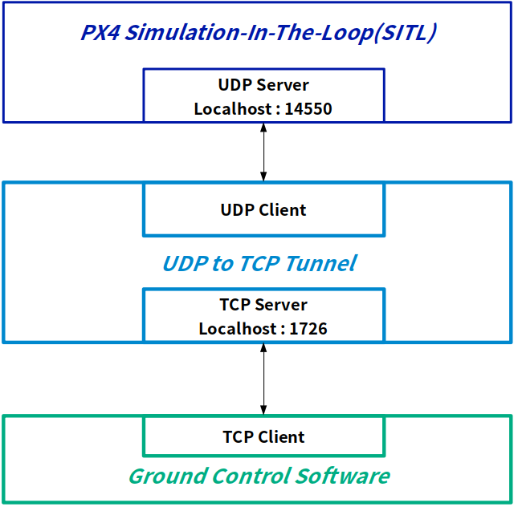

# PX4 Simulation for OJT

This repo is generated on the job training for intership program.
As It's considered to execute PX4 SITL simulation with WSL1(Windows Subsystem for Linux1),
> Also checked driven in Ubuntu 18.04.5

some posix code has been modified specially. And communication between PX4 SITL and GCS will be changed from UDP to TCP that it would be used for developing web based ground control system.

## How to install this repository

Follow the instructions below.
This instruction is only valid in WSL1.

1. Clone this repository
>git clone https://github.com/YongraeKim/PX4-Swon.git --recursive

2. Change user authentication
>sudo usermod -a -G dialout $(whoami)
>> or sudo usermod -a -G dialout $USER

3. Change folder's authentication
>sudo chmod -r 777 PX4-Swon

4. Go to the folder as shown below
>cd PX4-Swon/Tools/setup

5. Start the script
>source wsl.sh

6. Move to the origin folder
>cd ~/PX4-Swon

7. build PX4 with
>HEADLESS=1 make px4_sitl_default gazebo_iris
>>if this doesn't work,
>>>sudo HEADLESS=1 make px4_sitl_default gazebo_iris  
>>or  
>>>HEADLESS=1 make px4_sitl_default gazebo_iris

# UDP to TCP tunneling

PX4 SITL uses UDP(Port 14550) to communicate with QGroundControl. For developing some application, which uses TCP as major for communicating with drones, without additional UDP socket programming, it is required to use third-party UDP to TCP conversion programming.
This repository support UDP to TCP tunneling program which is located at
>/PX4-Swon/Tools/UDP2TCPtunnel
>> Still UDP to TCP tunnel only support 1:1 communication on 1.0.0, however 1:N or N:N will be supported for responding various situation such as multiple drone simulation, center-monitoring field-control ground system, or testing own developing ground control application with referencing QGC.

## Structure of UDP to TCP tunneling

## How to use UDP to TCP tunneling

1. Run PX4 SITL
> sudo make px4_sitl_default gazebo_iris

2. Open new terminal
> On windows, open new powershell and run ubuntu

3. Move to the directory
> /PX4-Swon/Tools/UDP2TCPtunnel

4. Type
> ./udp2tcp

5. Set TCP client on your application indicating
> localhost ip : 1726
